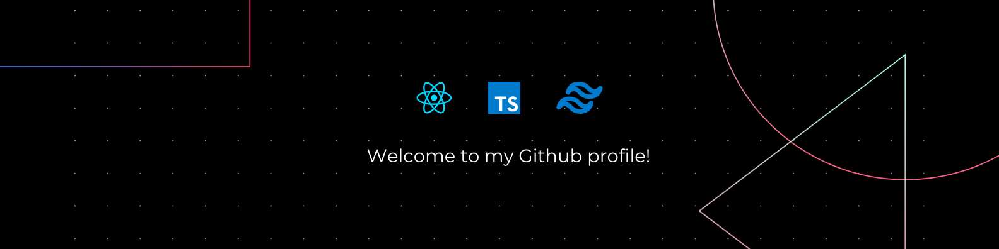

# 👋 Hello!

Software engineer specializing in scalable SaaS platforms and AI-driven applications. Experienced in building production-ready systems from architecture to deployment, with a focus on performance, maintainability, and rapid iteration.

---

## 🛠️ Technologies & Tools

<!--  -->
<!--  -->

---
